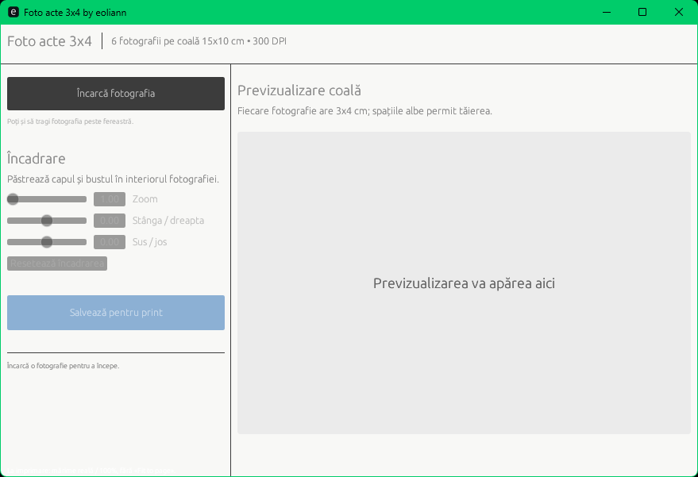
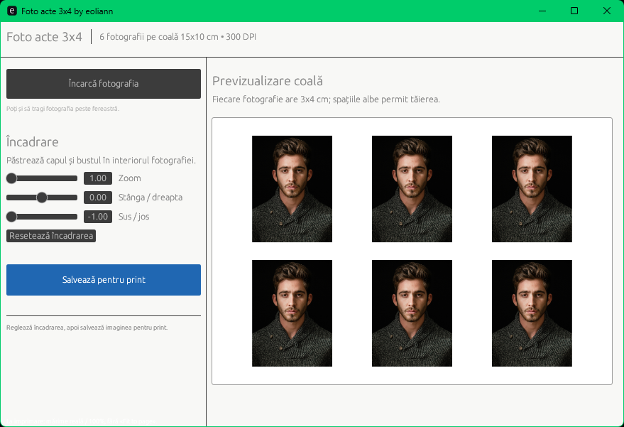
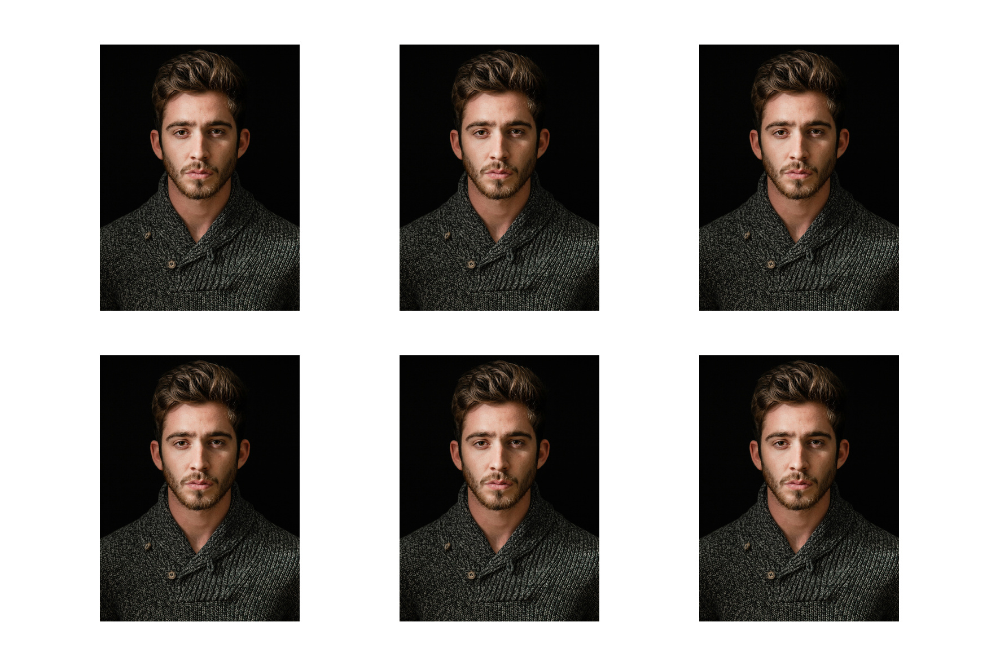

[](https://www.paypal.com/donate/?hosted_button_id=PTH2EXUDS423S)
[](https://revolut.me/adriannm9)
[](https://ko-fi.com/eoliann)


[](https://github.com/eoliann/Foto-acte-3x4/releases/latest/download/Foto-acte-3x4.exe)


[](LICENSE.md)

# Foto acte 3x4

Aplicație desktop Windows, portabilă și offline, care aranjează o fotografie în 6 exemplare de 3x4 cm pe o coală foto de 15x10 cm.

## Funcționalități

- export JPEG de 1772x1181 pixeli la 300 DPI;
- șase fotografii de 354x472 pixeli, aproximativ 3x4 cm fiecare;
- reglarea manuală a zoom-ului și poziției pentru o încadrare precisă;
- ajustarea luminozității și contrastului;
- eliminarea fundalului cu AI, complet offline;
- fundal alb, gri deschis, albastru deschis sau orice culoare din paletă;
- previzualizarea planșei înainte de salvare;
- încărcare prin selector de fișiere sau drag-and-drop;
- corectarea orientării EXIF pentru fotografiile realizate cu telefonul;
- procesare complet locală, fără încărcarea fotografiei pe internet.

## Galerie

<p align="center">
  
</p>
<p align="center">
  
  
</p>

## Descărcare

Descarcă arhiva pentru Windows din pagina [Releases](../../releases/latest), extrage `Foto-acte-3x4.exe` și pornește aplicația. Executabilul nu necesită instalare și nici Rust pe calculatorul utilizatorului.

Windows poate afișa avertismentul SmartScreen pentru executabile noi care nu sunt semnate digital. Verifică faptul că fișierul provine din pagina Releases a acestui repository.

## Utilizare

1. Deschide `Foto-acte-3x4.exe`.
2. Încarcă fotografia sau trage fișierul peste fereastră.
3. Reglează zoom-ul și poziția până când capul și bustul sunt încadrate corect.
4. Reglează luminozitatea și contrastul, elimină și setează fundalul.
5. Apasă **Salvează pentru print**.
6. Printează JPEG-ul la **100% / Actual size**, fără opțiunea `Fit to page`.

Aplicația nu detectează și nu modifică automat fața. Încadrarea manuală păstrează rezultatul previzibil și permite adaptarea la fiecare fotografie.

Pentru înlocuirea fundalului, selectează una dintre culorile predefinite sau opțiunea **Personalizat**. Prima procesare AI poate dura câteva secunde, în funcție de procesor; toate ajustările ulterioare sunt afișate imediat.

## Formate acceptate

La intrare sunt acceptate JPEG, PNG, WebP și BMP. Rezultatul este salvat în format JPEG cu metadate de 300 DPI.

## Dezvoltare

Este necesar [Rust](https://www.rust-lang.org/tools/install) 1.94 sau mai nou.

```powershell
cargo run
```

Verificările locale sunt:

```powershell
cargo fmt -- --check
cargo test --locked
cargo clippy --locked --all-targets -- -D warnings
```

## Build portabil

Din PowerShell rulează:

```powershell
.\build-portable.ps1
```

Executabilul independent va fi creat în `dist\Foto-acte-3x4.exe`.

## Publicarea unei versiuni

Workflow-ul GitHub Actions construiește și testează proiectul la fiecare push și pull request. Un tag cu forma `v1.1.2` creează automat un GitHub Release care conține arhiva Windows:

```powershell
git tag v1.1.2
git push origin v1.1.2
```

## Tehnologii

Interfața este realizată în Rust cu `eframe/egui`, procesarea imaginilor folosește crate-ul `image`, iar eliminarea fundalului folosește modelul MODNet prin runtime-ul `RTen`.

Modelul AI este inclus în executabil și este distribuit conform licenței Apache-2.0. Proveniența și licența sa sunt documentate în [`assets/README.md`](assets/README.md).
